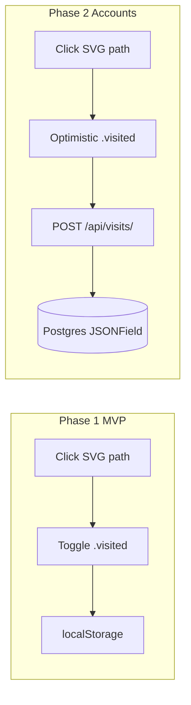

# Scratch Pass — Project Plan & Architecture

> **Task tracking lives in [`CHECKLIST.md`](./CHECKLIST.md)** (tickets
> `SP-1`…`SP-13`). This doc is architecture/rationale — update it when a
> locked decision changes, but track build progress in `CHECKLIST.md`, not
> here.

## Stack decisions (locked)

### Frontend: Vanilla HTML/CSS/JS in Django templates — **best fit**

| Option | Verdict for this app |
|--------|----------------------|
| **Vanilla + Django Templates** | **Chosen.** Click → CSS class → paint. No build step, perfect for SVG + CSS transitions, mobile-friendly, trivial to deploy with Django. |
| Alpine.js / htmx | Useful later for auth forms / partial updates; unnecessary for Phase 1 toggle logic. |
| React / Vue / Vite SPA | Overkill: graph of ~200 paths, no complex UI state tree, adds toolchain without UX gain. |

**Why vanilla wins here:** The interaction model is a class toggle + fill transition on SVG `<path>` elements. CSS handles the “scratch” feel (`fill`, `transition`, `transform`). JS only needs: click handler, `localStorage` sync, and later a thin `fetch` layer. A SPA framework would mostly wrap that same logic.

### Database: Django relational (auth) + document-style visited payload — **not raw Mongo as primary**

At this scale (hundreds of region codes per user), **any** store is instant. The real constraint is Django’s first-class `User` model and future secure accounts.

**Chosen storage strategy:**

1. **Phase 1:** Browser `localStorage` only (no server DB for visits).
2. **Phase 2 source of truth:** Django ORM on **SQLite (dev) → PostgreSQL (prod)** with a `UserProfile.visited_regions` **JSONField** (document-shaped list — NoSQL-like ergonomics, zero Mongo ops friction).
3. **No Redis** for now — unnecessary overhead; revisit only if real multi-device caching pressure appears later.

**Why not MongoDB as primary:** Auth, sessions, admin, and migrations stay awkward; hybrid Django-SQL + Mongo doubles operational cost for no meaningful gain on a compact document. Keep Mongo for other projects if needed.



---

## 1. Project directory layout

**Default path:** `~/Projects/scratch-pass` (create `~/Projects` if missing). Project name: **`scratch-pass`**.

```
scratch-pass/
├── manage.py
├── requirements.txt
├── .gitignore
├── README.md
├── config/                 # project package
│   ├── __init__.py
│   ├── settings.py
│   ├── urls.py
│   ├── wsgi.py             # sync production entry (Gunicorn/uWSGI)
│   └── asgi.py             # async-capable entry (Daphne/Uvicorn; optional later)
├── maps/                   # core app
│   ├── __init__.py
│   ├── admin.py
│   ├── apps.py
│   ├── models.py           # Phase 2: UserProfile
│   ├── views.py            # map page (+ later API)
│   ├── urls.py
│   ├── tests.py
│   └── templates/
│       └── maps/
│           └── map.html    # interactive SVG map
└── static/
    ├── css/
    │   └── map.css
    └── js/
        └── map.js
```

### What `wsgi.py` and `asgi.py` are

Django generates both under `config/` when you run `startproject`. You do **not** edit them for MVP map logic — they are **deployment entrypoints**.

| File | Role |
|------|------|
| **`wsgi.py`** | **WSGI** (Web Server Gateway Interface) — the classic sync Python app interface. Production servers like **Gunicorn** or **uWSGI** import `config.wsgi:application` and forward HTTP requests into Django. **This is what you use for Scratch Pass Phase 1–2** (normal views, templates, form/API posts). |
| **`asgi.py`** | **ASGI** (Asynchronous Server Gateway Interface) — same idea, but supports async views, WebSockets, HTTP/2-style stacks via **Uvicorn**, **Daphne**, or **Hypercorn**. Only needed if you later add websockets, heavy async I/O, or Channels. |

Typical Gunicorn line (later, when deploying):

```bash
gunicorn config.wsgi:application
```

Both files basically: set `DJANGO_SETTINGS_MODULE=config.settings`, then expose `application = get_wsgi_application()` / `get_asgi_application()`. Keep them; ignore them until deploy.

### Directory notes

- App templates live under `maps/templates/maps/` (Django app-namespace convention).
- Global static assets under project-level `static/` with `STATICFILES_DIRS`.
- SVG: inline in `map.html` (simplest) or `` when large.

---

## 2. Phase 1 — Visual MVP

### Goal

Anonymous users open `/`, click **countries**, see smooth fill fade + light scale, state survives refresh via `localStorage`.

### Region ID scheme (MVP now → subdivisions later)

| Phase | `data-region` / stored value | Examples |
|-------|------------------------------|----------|
| **MVP (now)** | Country only — ISO 3166-1 alpha-2 | `"IT"`, `"DE"`, `"US"` |
| **Future** | `COUNTRY:SUBREGION` | `"IT:TO"` (Tuscany), `"DE:BY"` (Bavaria) |

**Rules:**

- Always use a **single string** in the visited array (same shape forever).
- Separator is **`:`** — country code, then local subdivision code (ISO 3166-2 suffix or a fixed internal code).
- MVP SVG paths use country ids only (`data-region="IT"`).
- When you add Italy/Germany drill-down maps later, those paths use `data-region="IT:TO"`; country-level `"IT"` can remain a separate “whole country” mark or be derived (product decision later).
- Version `localStorage` key when migrating (`v1` → `v2`) if you ever rewrite old country-only entries.

### Django view

- `maps.views.map_view` → `render(request, "maps/map.html")`
- URL: `path("", map_view, name="map")` wired from `config/urls.py` → `include("maps.urls")`

### Template pattern (SVG path + hooks)

```html

<!DOCTYPE html>
<html lang="en">
<head>
  <meta name="viewport" content="width=device-width, initial-scale=1">
  <link rel="stylesheet" href="">
</head>
<body>
  <main class="map-shell">
    <h1>Scratch Pass</h1>
    <svg class="world-map" viewBox="0 0 1000 500" role="img" aria-label="World map">
      <path id="US" data-region="US" class="region" d="M..." />
      <path id="IT" data-region="IT" class="region" d="M..." />
      <!-- Future: <path data-region="IT:TO" class="region" d="M..." /> -->
    </svg>
  </main>
  <script src=""></script>
</body>
</html>
```

**Map asset:** Simplified world SVG (e.g. public-domain Natural Earth–derived). One `<path>` per clickable unit; avoid nested groups that break hit-testing.

### CSS — hardware-friendly scratch feel

```css
.world-map { width: 100%; height: auto; touch-action: manipulation; }
.region {
  fill: #d4d8de;
  stroke: #fff;
  stroke-width: 0.5;
  transform-box: fill-box;
  transform-origin: center;
  transition:
    fill 420ms ease,
    transform 220ms ease,
    filter 220ms ease;
  cursor: pointer;
}
.region:hover,
.region:focus-visible {
  transform: scale(1.03);
  filter: brightness(0.96);
}
.region.visited {
  fill: #2a9d8f;
}
@media (prefers-reduced-motion: reduce) {
  .region { transition: none; }
}
```

Prefer animating **`fill` + `transform`** only.

### JS — toggle + localStorage

```js
const KEY = "scratchpass:visited:v1";
const load = () => JSON.parse(localStorage.getItem(KEY) || "[]");
const save = (ids) => localStorage.setItem(KEY, JSON.stringify(ids));

function applyVisited(ids) {
  document.querySelectorAll(".region").forEach((el) => {
    el.classList.toggle("visited", ids.includes(el.dataset.region));
  });
}

let visited = load();
applyVisited(visited);

document.querySelector(".world-map")?.addEventListener("click", (e) => {
  const path = e.target.closest(".region");
  if (!path) return;
  const id = path.dataset.region; // MVP: "IT" — future: "IT:TO"
  visited = visited.includes(id)
    ? visited.filter((x) => x !== id)
    : [...visited, id];
  save(visited);
  path.classList.toggle("visited", visited.includes(id));
});
```

### Phase 1 localStorage schema

```json
{
  "key": "scratchpass:visited:v1",
  "value": ["US", "FR", "IT"]
}
```

- **Type:** JSON array of region id strings.
- **MVP values:** country codes only.
- **Future values (same array):** e.g. `["US", "IT:TO", "DE:BY"]` — no schema change, only id format.
- **Toggle:** add if absent, remove if present.
- **Version suffix (`v1`):** allows migrate if you ever change shape or rewrite legacy country-only lists.

---

## 3. Phase 2 — Accounts & persistence blueprint

### Models (Django ORM + document field)

**Recommended (one row per user — document-style):**

```python
from django.conf import settings
from django.db import models

class UserProfile(models.Model):
    user = models.OneToOneField(
        settings.AUTH_USER_MODEL,
        on_delete=models.CASCADE,
        related_name="profile",
    )
    # Document-like list; MVP: ["IT"], later also ["IT:TO"]
    visited_regions = models.JSONField(default=list, blank=True)
    updated_at = models.DateTimeField(auto_now=True)

    def __str__(self):
        return f"Profile<{self.user_id}>"
```

**Alternate normalized model** (if you need per-region admin/querying):

```python
class VisitedRegion(models.Model):
    user = models.ForeignKey(
        settings.AUTH_USER_MODEL,
        on_delete=models.CASCADE,
        related_name="visited_regions",
    )
    region_code = models.CharField(max_length=16)  # "IT" or "IT:TO"
    visited_at = models.DateTimeField(auto_now_add=True)

    class Meta:
        constraints = [
            models.UniqueConstraint(
                fields=["user", "region_code"],
                name="uniq_user_region",
            )
        ]
```

**Plan default:** `UserProfile.visited_regions` JSON list — matches localStorage, one read to hydrate the map. Cap `region_code` / string length at ≥16 to fit `CC:SUBDIV`.

### Frontend transition: localStorage → API

1. Keep **optimistic UI** (toggle `.visited` immediately).
2. On auth: `GET /api/me/visits/` → replace/merge local state; paint map.
3. On click: `POST /api/me/visits/toggle/` with `{ "region": "IT" }` (later `"IT:TO"`) → server returns new list; sync `localStorage` as offline cache.
4. Guest mode keeps localStorage; on first login, offer **merge** (union of local + server).

```js
async function toggleRegion(id) {
  path.classList.toggle("visited"); // optimistic
  const res = await fetch("/api/me/visits/toggle/", {
    method: "POST",
    headers: {
      "Content-Type": "application/json",
      "X-CSRFToken": getCookie("csrftoken"),
    },
    body: JSON.stringify({ region: id }),
  });
  if (!res.ok) { /* revert class */ return; }
  const { visited } = await res.json();
  localStorage.setItem(KEY, JSON.stringify(visited));
  applyVisited(visited);
}
```

### Phase 2 DB schema (logical)

| Store | Structure |
|-------|-----------|
| `auth_user` | Django built-in |
| `maps_userprofile` | `user_id` PK/FK, `visited_regions` JSON (`["IT"]` / later `["IT:TO"]`), `updated_at` |

No Redis.

---

## 4. Implementation phases (execution order)

1. Scaffold Django project + `maps` app + static dirs under `~/Projects/scratch-pass`.
2. Map view + template shell + placeholder SVG (2–3 countries to prove UX).
3. Full world SVG asset + CSS polish + JS localStorage (country IDs).
4. Mobile pass: viewport, touch targets, reduced motion.
5. (Later) Auth + `UserProfile` + toggle API; then subdivision maps with `COUNTRY:SUBREGION` ids.

---

## 5. Step-by-step Cursor developer prompts

Use these **in order** after creating/`move_agent_to_root` into `~/Projects/scratch-pass`.

### Prompt 1 — Boilerplate

```
Create a Django project named config in the current directory and an app named maps.
Project name / product title: Scratch Pass. Path is ~/Projects/scratch-pass.
Add requirements.txt (Django LTS), .gitignore, README.
Leave config/wsgi.py and config/asgi.py as Django defaults (WSGI for Gunicorn deploy; ASGI unused for now).
Configure TEMPLATES and STATICFILES_DIRS so templates live in maps/templates/ and static files in project-level static/css and static/js.
Wire maps.urls into config.urls at "".
Add maps.views.map_view that renders maps/map.html.
Create empty static/css/map.css and static/js/map.js, and a minimal map.html that loads them with .
Do not add React, Vite, Redis, or other frontend frameworks.
```

### Prompt 2 — Interactive map MVP

```
Build the Phase 1 Scratch Pass MVP in maps/templates/maps/map.html, static/css/map.css, and static/js/map.js.
Inline (or include) an SVG with multiple country paths; each path must have class "region" and data-region with an ISO 3166-1 alpha-2 country code (e.g. IT, DE, US)—no subregions yet.
On click, toggle class "visited". Persist visited codes as a JSON string array in localStorage under key "scratchpass:visited:v1". On load, re-apply .visited from localStorage.
Use CSS transitions on fill and transform for a smooth scratch effect; support prefers-reduced-motion; make the layout mobile-friendly.
Keep JS vanilla and small—no npm packages. Comment that future subdivision ids will look like "IT:TO".
```

### Prompt 3 — Visual polish + Phase 2 stubs

```
Polish map.css for a cohesive visited color, hover/focus-visible scale, and clean typography/layout (no purple AI-default theme). Brand title: Scratch Pass.
Add a short comment block in map.js documenting how to swap localStorage writes for fetch POST /api/me/visits/toggle/ with CSRF.
In maps/models.py, add UserProfile with OneToOne User and JSONField visited_regions (default list; values like "IT" now, later "IT:TO"). Register it in admin. Do not implement API endpoints or Redis.
```

---

## 6. Success criteria (Phase 1)

- `/` loads a responsive SVG map titled Scratch Pass.
- Click toggles visited with a visible fill fade.
- Refresh restores country codes from `localStorage` (`scratchpass:visited:v1`).
- Works on mobile viewport without horizontal overflow.
- Zero frontend build tooling; no Redis.
